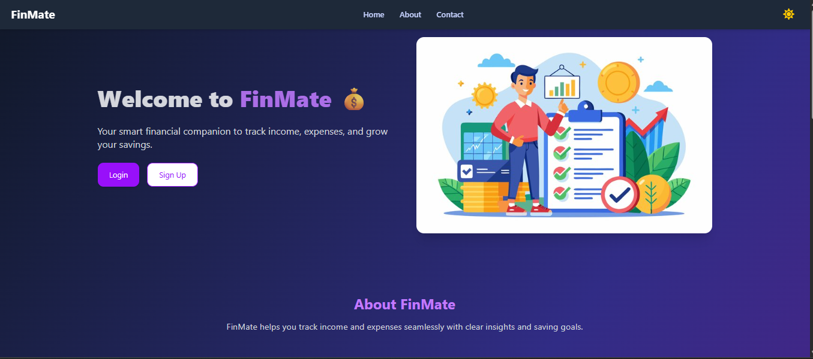
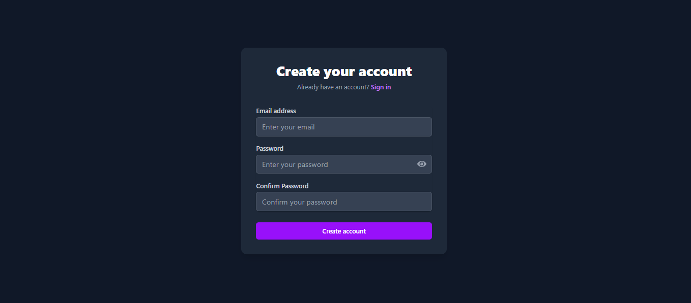
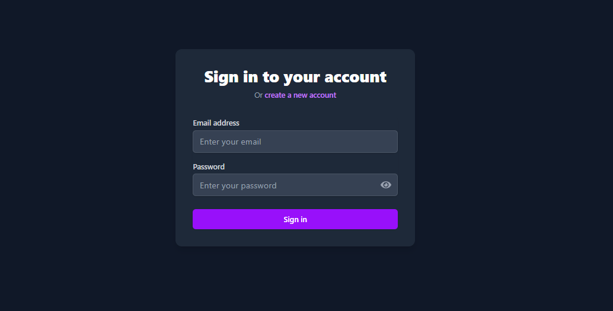
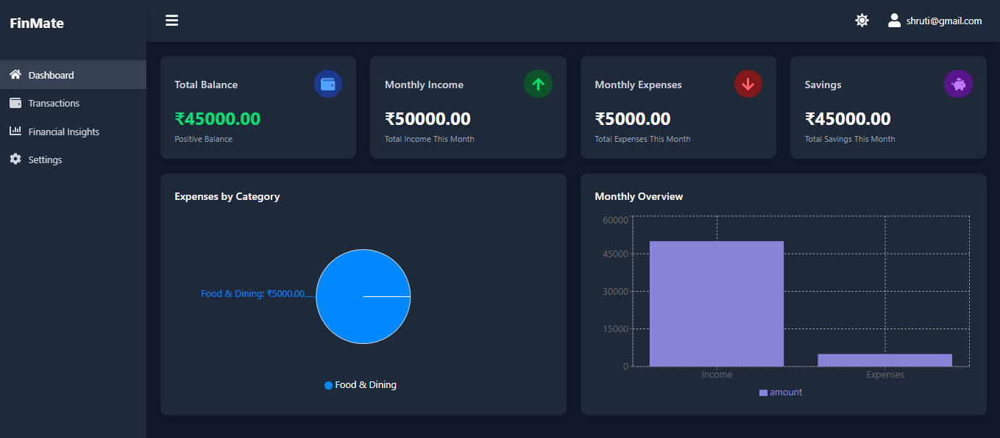
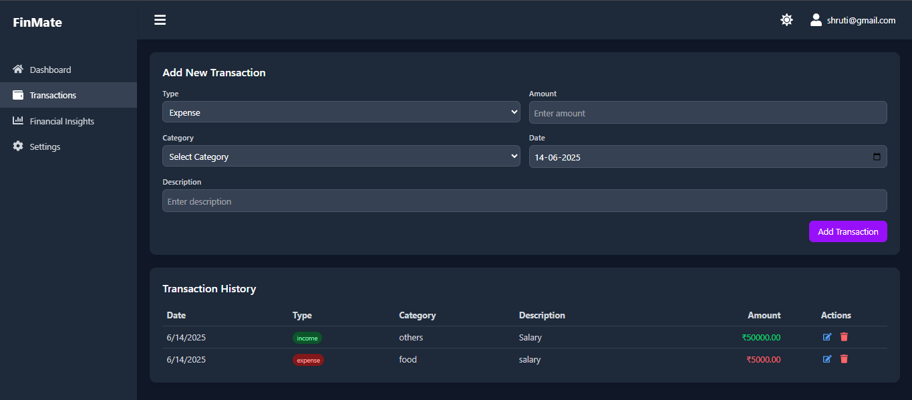
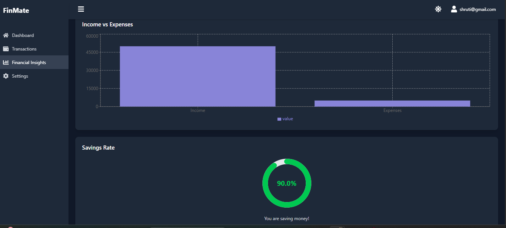

# 💰 Personal Finance Tracker

A web application that helps users manage their personal finances by tracking income, expenses, and savings. It allows users to visualize financial data through dashboards, set savings goals, and make informed financial decisions.

🔗 **Live Demo:** [Click here to view the project on Netlify](https://warm-semolina-0b9486.netlify.app/)

---

## 📸 Screenshots

### 🏠 Dashboard


###  SignUp Page


###  Login Page


###  Dashboard Page


###  Transcations Page


###  Finanicial Insights


---

## 📖 Project Context

This application enables users to:
- Track income, expenses, and savings
- Set monthly budgets and financial goals
- Visualize data using graphs and reports
- Gain insights and tips based on their spending behavior

---

## 🎯 Project Goal

To create a secure and intuitive platform where users can:
- Input and categorize income/expenses
- Monitor financial status in real-time
- Get insights and build better financial habits

---

## 🚀 Features

### ✅ Minimum Features

- **🔐 User Authentication:** Secure login/signup with email verification
- **📊 Dashboard Overview:** Summary of income, expenses, savings
- **💰 Income Tracking:** Add income by amount, date, and source
- **💸 Expense Tracking:** Add categorized expenses with amount and date
- **📈 Budgeting Tool:** Set monthly budgets and get alerts when exceeded
- **🗓️ Monthly Reports:** View monthly summaries with interactive charts

### 🌟 Unique Features

- Custom expense categories
- Savings goal tracking
- Recurring income/expense setup
- Export data as CSV or PDF
- Financial insights and improvement tips

### 🔥 Challenging Features

- Advanced charts using Chart.js
- User behavior analytics
- Notifications & reminders
- Multi-currency support
- Mobile responsiveness

---

## 🛠️ Tech Stack

- **Frontend:** React.js, Tailwind CSS
- **Backend:** Firebase (Auth + Firestore)
- **Charts:** Chart.js
- **Hosting:** Netlify

---

## 📁 Folder Structure
📦 personal-finance-tracker
 ┣ 📂node_modules
 ┣ 📂public
 ┣ 📂src
 ┃ ┣ 📂assets
 ┃ ┣ 📂components
 ┃ ┣ 📂context
 ┃ ┣ 📂firebase
 ┃ ┣ 📂pages
 ┃ ┗ 📜App.js
 ┣ 📂screenshots  ✅ <-- NEW folder at root level
 ┃ ┣ 📜Home.png
 ┃ ┣ 📜Signup.png
 ┃ ┣ 📜Login.png
 ┃ ┣ 📜dashboard.png
 ┃ ┣ 📜transcations.png
 ┃ ┗ 📜finanicial insights.png
 ┣ 📜README.md       
 ┣ 📜package.json
 ┗ 📜.gitignore

 
---

## ⚙️ How to Run Locally

```bash
# Clone the repository
git clone https://github.com/your-username/personal-finance-tracker.git

# Navigate into the project folder
cd personal-finance-tracker

# Install dependencies
npm install

# Start the development server
npm run dev

